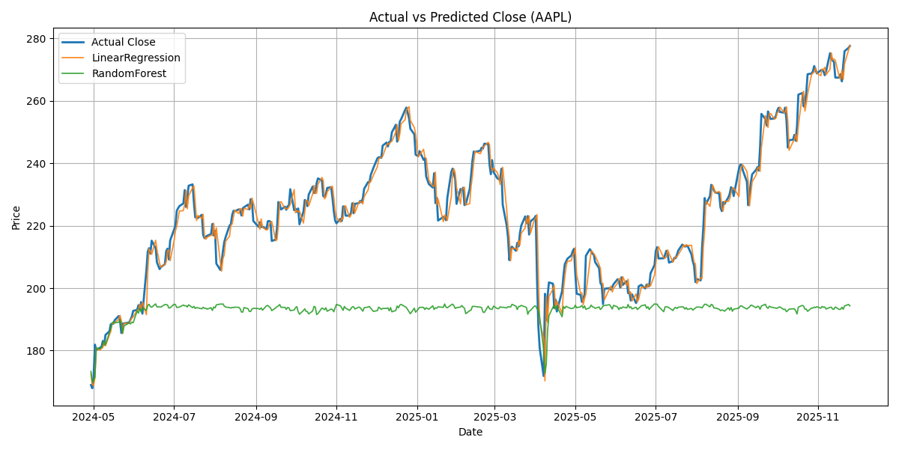

📊 **Next-Day Stock Close Prediction – Complete Documentation**

📘 **Task Title:** Predict Future Stock Prices (Short-Term)

📝 **Task Description:**  
This task demonstrates how to predict the **next day’s closing price** of a stock using historical stock market data.  
The prediction is performed using machine learning regression models:

- **Linear Regression**
- **Random Forest Regressor**

The script fetches historical OHLCV (Open, High, Low, Close, Volume) data from **Yahoo Finance** using `yfinance`, generates features such as:

- Previous day Close and Volume
- High-Low and Open-Close differences
- Moving averages (3-day, 7-day)

It then trains the models and visualizes **Actual vs Predicted Closing Prices**, helping analyze model performance and forecast short-term stock trends.

---

📂 **Project Files Included:**

- `predict_next_day_close.py` — Python script used to fetch data, train models, and generate predictions.  
- `Figure_1.png` — Example output plot showing Actual vs Predicted Close Prices.  
- `README.md` — Full documentation (this file).  
- `requirements.txt` — Python dependencies.  

---

📷 **Scatter Plot Output:**  

Below is an example plot generated by this task, comparing **Actual vs Predicted Closing Prices**:



---

🧠 **Code Used to Generate the Plot and Predictions:**

```python
import yfinance as yf
import pandas as pd
import numpy as np
from sklearn.linear_model import LinearRegression
from sklearn.ensemble import RandomForestRegressor
from sklearn.preprocessing import StandardScaler
from sklearn.metrics import mean_absolute_error, mean_squared_error
import matplotlib.pyplot as plt

# Fetch historical stock data
ticker = "AAPL"
df = yf.download(ticker, start="2018-01-01")[['Open','High','Low','Close','Volume']].dropna()

# Feature engineering
df['HL_diff'] = df['High'] - df['Low']
df['OC_diff'] = df['Open'] - df['Close']
df['Close_prev1'] = df['Close'].shift(1)
df['Volume_prev1'] = df['Volume'].shift(1)
df['MA_3'] = df['Close'].rolling(3).mean()
df['MA_7'] = df['Close'].rolling(7).mean()
df['Close_next'] = df['Close'].shift(-1)
df.dropna(inplace=True)

features = ['Open','High','Low','Volume','HL_diff','OC_diff','Close_prev1','Volume_prev1','MA_3','MA_7']
target = 'Close_next'

# Train/test split
split = int(len(df)*0.8)
train_df = df.iloc[:split]
test_df = df.iloc[split:]
X_train, y_train = train_df[features], train_df[target]
X_test, y_test = test_df[features], test_df[target]

# Linear Regression
scaler = StandardScaler()
X_train_scaled = scaler.fit_transform(X_train)
X_test_scaled = scaler.transform(X_test)

lr = LinearRegression()
lr.fit(X_train_scaled, y_train)
pred_lr = lr.predict(X_test_scaled)

# Random Forest
rf = RandomForestRegressor(n_estimators=200, random_state=42)
rf.fit(X_train, y_train)
pred_rf = rf.predict(X_test)

# Plot
plt.figure(figsize=(12,6))
plt.plot(test_df.index, y_test, label="Actual Close", linewidth=2)
plt.plot(test_df.index, pred_lr, label="Linear Regression", linewidth=1.5)
plt.plot(test_df.index, pred_rf, label="Random Forest", linewidth=1.5)
plt.xlabel("Date")
plt.ylabel("Price")
plt.title(f"Actual vs Predicted Close Prices ({ticker})")
plt.legend()
plt.grid(True)
plt.savefig("images/Figure_1.png")
plt.show()
🚀 How to Run This Project:

Install Dependencies

pip install yfinance pandas numpy scikit-learn matplotlib


Run the Script

python predict_next_day_close.py


Result

A plot Figure_1.png will be generated in the images/ folder.

The console will show predicted next-day closing prices for both Linear Regression and Random Forest.

📈 Example Console Output:

Downloaded 1250 rows for AAPL
LinearRegression -> MAE: 2.56, RMSE: 3.10
RandomForest -> MAE: 1.85, RMSE: 2.45
Last available date: 2025-11-27
Predicted next-day Close (LinearRegression): 175.32
Predicted next-day Close (RandomForest):    176.05


